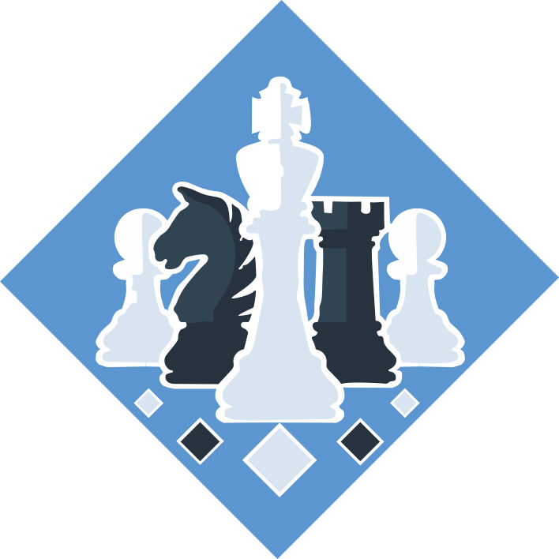
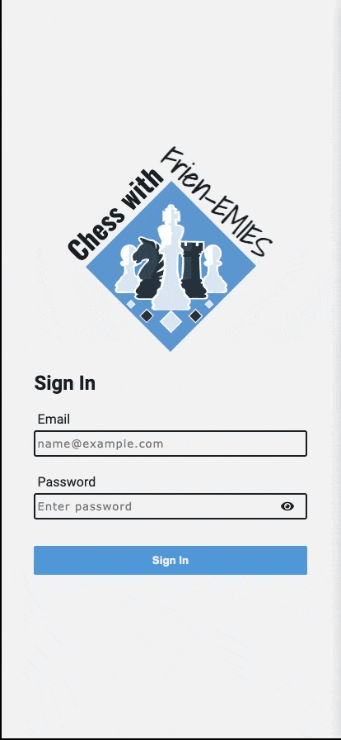
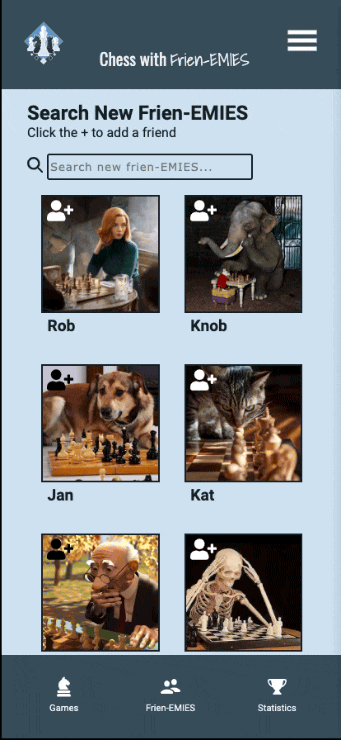
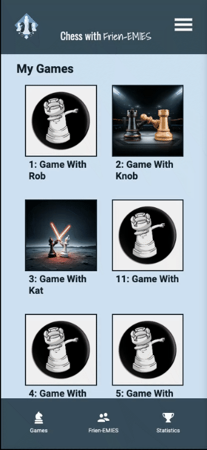
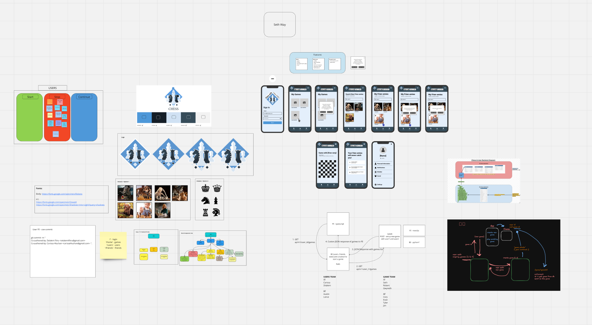

# [ Chess With Fren-EMIES ](https://users-fe-app.vercel.app)

### Abstract:
[//]: <> (Briefly describe what you built and its features. What problem is the app solving? How does this application solve that problem?)
Chess with Fren-EMIES is a phone application for playing chess with friends.

Chess with Fren-EMIES is designed to cater to casual and competitive players, creating a platform for social interaction through chess. Users have the ability to connect with friends and make new friends in the chess community. It leverages real-time capability, allowing users to engage in matches smoothly while managing their friend lists and tracking their progress.

This project represents the user-side of a dynamic chess game application, developed in collaboration with a backend team to ensure effective integration of game data, friend lists, and user management. Chess with Fren-EMIES allows the user to log in, add or remove friends, and can play chess with other users that are on the friends list.  

Connected repositories:
Game FE: (https://github.com/seth-way/chess_fe_microservice)
Game BE: (https://github.com/frien-emies/chess-game-be)
Users BE: (https://github.com/frien-emies/users_BE)

### Technologies

 

 

 

 

 

 

### Installation Instructions:
[//]: <> (What steps does a person have to take to get your app cloned down and running?)

**1. Click the Title to run the app.**
- This App is designed for cell phones
- Open Chrome dev tools to view the app in a cell phone view

**2. _(optional) Fork this project to your own Github account._**
> [!WARNING]
> **[Node.js](https://nodejs.org/en), [npm](https://www.npmjs.com/) are required to run this app.** 
> _Please ensure you have both installed on your machine before proceeding._
  - Clone the repository to your local machine.
  - `cd` into the project folder.
  - Use the `npm install` command to install the project dependencies.
  - Use the `npm install @react-icons/all-files --save` command to install `React Icons`
  - Use the `npm start` command to run webpack.
  - Check the console for the `PORT` and copy/paste `localhost:PORT` into your web browser.

**3. To run Cypress testing**
- in the console type `npm run cypress`
- for issues: [Follow these instructions to install Cypress.](https://on.cypress.io/guides/installing-and-running#section-installing)

**4. Open Chrome dev tools to see the app in a cell phone view**

### Preview of App:
[//]: <> (Provide ONE gif or screenshot of your application - choose the "coolest" piece of functionality to show off.)

### Context:
[//]: <> (Give some context for the project here. How long did you have to work on it? How far into the Turing program are you?)

This team project was composed of 11 developers broken into 4 subteams:
1. FE Users team: 2 developers
2. BE Users team: 2 developers
3. FE Games team: 3 developers 
4. BE Games team: 3 developers

This repo represents the FE Users team code, the host application for the entire project. We are in our 27th week of an intensive web-development training program. It took us 6 days of planning and 6 days or 35 hours to code to completion.

### Design:

[Design Board](https://miro.com/app/board/uXjVLVAVBFk=/)

### Contributors:
[//]: <> (Who worked on this application? Link to their GitHubs.)

This code was built by the FE Users Team: 
 
[Carissa Hluchan](https://github.com/CarissaHluchan)
 
[Zelalem Fitru](https://github.com/ZTFitru)

### Learning Goals:
[//]: <> (What were the learning goals of this project? What tech did you work with?)

- Use an agile process to turn well defined requirements into deployed and production ready software.
- Gain experience dividing applications into components and domains of responsibilities to facilitate multi-developer teams. Service oriented architecture concepts and patterns are highly encouraged.
- Explore and implement new concepts, patterns, or libraries that have not been explicitly taught while at Turing.
- Practice an advanced, professional git workflow including a Pull Request Review.
- Gain experience using continuous integration tools to build and automate the deployment of features.
- Build applications that execute in development, test, CI, and production environments.
- Focus on communication between front-end and back-end teams in order to complete and deploy features that have been outlined by the project spec.

### Wins + Challenges:
[//]: <> (What are 2-3 wins you have from this project? What were some challenges you faced - and how did you get over them?)

- Wins:
    - Successfully coding 15 components in React within the given timeframe.
    - This was our first project working with a back-end team writing asynchronous functions for 6 GET's, 3 POST's, and 2 DELETE's.
    - The effective communication with the backend team, allowed quick problem-solving.

- Challenges: 
    - Connecting to a micor-server to connect our user side with the game side.
    - This was our first time writing functions to mount POST and DELETE requests, which proved challenging, but through the debugging process, we were able to complete this successfully. 
